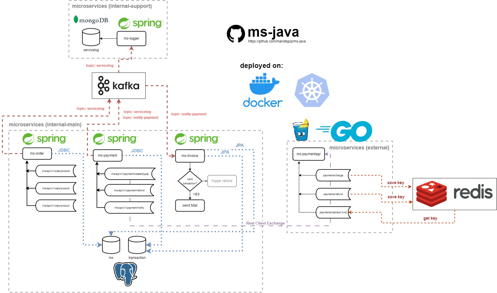
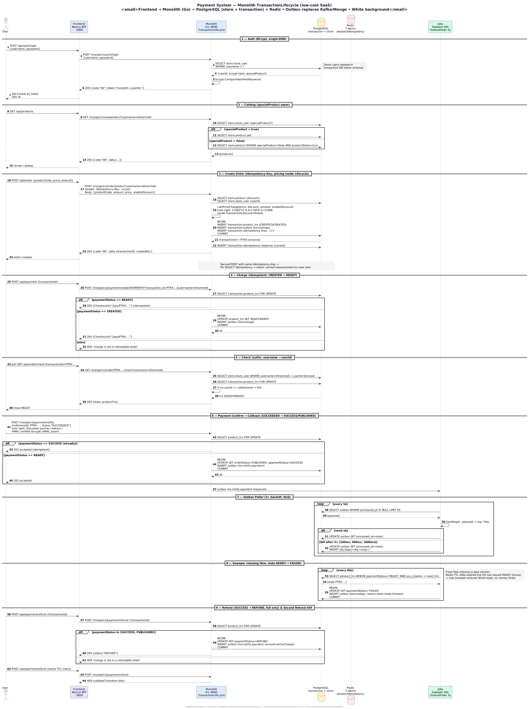

# payment-system

## Overview

Microservices-based payment system with a modern web frontend — now with a low-cost **Go monolith** option (`monolith/`) that deepens the scattered payment lifecycle into a single `TransactionLifecycle` Module.

* **frontend** - Next.js (App Router) web portal: login, product catalog, order placement, payment checkout, status tracking and refunds
* **monolith** - **Go (new, recommended for SaaS)** — `TransactionLifecycle` deep Module: order → charge → callback → refund, idempotency, authz, pricing, outbox + sweeper. Single binary, PG `transaction` + `store` schemas, Redis. Replaces `ms-order` + `ms-payment` + Kafka/Mongo for low-cost deploys
* **ms-order** - Java/Spring (legacy): user auth (session tokens), product inquiry and order creation
* **ms-payment** - Java/Spring (legacy): payment creation, refunds and secure payment callbacks
* **ms-paymentagr** - Go/Gin + Redis: dummy payment partner (charge, refund, redirect/checkout page)
* **ms-invoice** - Java/Spring: consumes payment events from Kafka and provisions PDF invoice reports (monolith uses outbox instead)
* **ms-logger** - Java/Spring: consumes the `ms-event-log` topic and persists service logs to MongoDB (monolith logs to stdout → PG outbox)

## Architecture Diagrams

> Rendered from PlantUML (`assets/sequence-monolith.puml`) with **white background** (`skinparam backgroundColor #FFFFFF`) for docs/printing.

**Legacy microservices** — original design:



**Monolith TransactionLifecycle — low-cost SaaS (Go, 4 containers)** — deep Module `TransactionLifecycle` owns state chart `CREATED→READY→SUCCESS→REFUND`, pricing, idempotency (`Idempotency-Key`), authz (`username→userId`), outbox (replaces Kafka/Mongo), sweeper (stale `READY→FAILED` after 5m):



Source: [`assets/sequence-monolith.puml`](assets/sequence-monolith.puml) — re-render with `docker run --rm -v "$(pwd)/assets:/data" plantuml/plantuml /data/sequence-monolith.puml -tpng`

## Tech Stack

* **Go 1.25 monolith** - `TransactionLifecycle` deep Module (recommended for SaaS): `net/http` stdlib, `pgx` + PG outbox/idempotency, sweeper + poller, white-background PlantUML docs
* Java Spring Boot 17 - legacy (ms-order, ms-payment, ms-logger, ms-invoice)
* PostgreSQL - `transaction` + `store` schemas (monolith single-DSN) and legacy `ms` DB
* MongoDB - service log storage (legacy ms-logger; monolith uses PG outbox + stdout)
* Kafka - event streaming between legacy services (monolith replaces with PG outbox)
* Go + Gin + Redis - ms-paymentagr (payment partner simulation)
* Next.js 16 + TypeScript + Tailwind CSS - web frontend (wired to `monolith:8085` when `MS_ORDER_URL`/`MS_PAYMENT_URL` point to monolith)
* Docker Compose - full-stack or minimal `postgres+redis+monolith+frontend` (4 containers, −60% RAM vs 11)

## Getting Started

### 1. Prerequisites

* Docker with Docker Compose v2
* Node.js 20+ and npm (only for frontend development outside Docker)

### 2. Configure environment

```bash
cd project
cp .env.example .env
# EDIT .env and change every secret before deploying
```

### 3. Build and start all services

```bash
# Minimal low-cost stack (recommended): postgres + redis + monolith + frontend — 4 containers
# Seeds PostgreSQL (store + transaction schemas + outbox/idempotency + demo users/products) on first boot
cd project && docker compose up --build postgres redis monolith frontend

# Full legacy stack (11 containers) — still works for comparison
# docker compose up --build
```

This seeds PostgreSQL (schemas + demo users/products) on first boot, then starts all services. The new `22-monolith-outbox.sql` seeds `store.*` into the `transaction` DB so the monolith can serve `store` reads via a single `DATABASE_URL`.

### 4. Access the system

* **Web portal**: http://localhost:3000 (via `monolith:8085` when `MS_ORDER_URL`/`MS_PAYMENT_URL=http://monolith:8085`)
* **monolith** (API, Go): http://localhost:8085 — `GET /health`, `GET /ms/api/v1/view/product`, `POST /ms/api/v1/auth/login`, `POST /ms/api/v1/order/product`, `POST /ms/api/v1/payment/create/{type}` — and new `POST /v1/order`, `POST /v1/payment/charge`, etc.
* **ms-order** (API, legacy): http://localhost:8080 - Swagger UI at `/swagger-ui.html`
* **ms-payment** (API, legacy): http://localhost:9090
* **ms-paymentagr**: http://localhost:8081 (`/health`)
* **ms-invoice**: http://localhost:8082
* **ms-logger**: http://localhost:1337 (`/ms/api/v1/health/check`)
* **kafka-ui**: http://localhost:8090 (legacy only)

### 5. Demo accounts

Seeded in PostgreSQL on first boot (see `project/pg-init-scripts/sql/20-store-schema.sql`):

| Username   | Password      | Access            |
|------------|---------------|-------------------|
| `klhomme0` | `user1Pass!`  | special products  |
| `ewhicher1`| `user2Pass!`  | standard products |
| `jdecreuze2`| `user3Pass!` | special products  |
| `admin1`   | `adminPass!`  | special products  |

### 6. End-to-end flow (via monolith when wired)

1. Sign in on the web portal (`POST /ms/api/v1/auth/login` → BCrypt verify, `store.store_user`)
2. Pick a product from the catalog (`GET /ms/api/v1/view/product?username=` → specialProduct filter)
3. Place order (`POST /ms/api/v1/order/product` with `Idempotency-Key` → `calcPriceCharge` inside `TransactionLifecycle`, `INSERT product_trx CREATED` + outbox + idempotency atomically)
4. Create payment (`POST /ms/api/v1/payment/create/SHOPEEPAY?transaction_id=` → `CREATED→READY`, idempotent second call returns same `CheckoutUrl`)
5. Confirm (frontend polls `GET /ms/api/v1/order/{id}/check?username=` with authz `username→userId` check; partner `POST /ms/api/v1/payment/notify` with `SUCCEEDED` → `READY→SUCCESS/PUBLISHED` + outbox `ms-notify-payment`)
6. Poller (5s) sends outbox, sweeper (60s) moves stale `READY→FAILED` after 5m (missing flow fixed — previously Redis TTL expired but PG row stayed `READY` forever)
7. Refund (`POST /ms/api/v1/payment/refund` → `SUCCESS→REFUND`, second refund 409)

Legacy Java flow still documented in `assets/simple-order-ms.txt` and `payment-system-sequence-diagram.png`; new flow is `assets/sequence-monolith.png` (white background).

### 7. Stopping the services

```bash
docker compose down
```

## Security

* **Authenticated payment callbacks** - ms-paymentagr signs every callback with HMAC-SHA256 (`NOTIFY_SECRET` + timestamp); ms-payment verifies signature and replay window before accepting
* **API key protection** - ms-paymentagr charge/refund endpoints require the `api-key` header (`PARTNER_API_KEY`)
* **Session-based auth** - ms-order issues short-lived opaque session tokens (in-memory, TTL); order placement accepts `Authorization: Bearer` tokens
* **Password hashing** - BCrypt for new credentials, legacy HMAC verification kept for backward compatibility
* **Login rate limiting** - per user/IP attempts (10 / 15 minutes)
* **No credential leakage** - user detail responses never expose password hashes or stored tokens
* **Parameterized SQL** - all queries use prepared statements; the previous string-replace query pattern was removed
* **Secrets via environment** - no hardcoded credentials in source or compose; `.env` is gitignored, a `.env.example` template is provided
* **Path traversal protection** - invoice filenames sanitize the transaction id
* **Kafka reliability** - consumers acknowledge only after processing (no lost events)
* **Dependency updates** - gson 2.11, gin 1.10, go-redis 9.5, x/net 0.25, JasperReports 6.21.4, Next.js 16 (npm audit clean)
* **Container hardening** - all containers run as non-root users; infra ports bind to `127.0.0.1` only
* **Security headers** - CORS allowlist plus `X-Content-Type-Options`, `X-Frame-Options`, `CSP`, `Referrer-Policy`, `Cache-Control: no-store`
* **Removed attack surface** - unauthenticated log-publish endpoint removed, partner `/payments/test` endpoint removed
* **Live DB data no longer committed** - `project/db-data/` is removed from the repository

## Testing

```bash
# Go monolith — TransactionLifecycle deep Module (Interface is test surface, 7 unit + 16 e2e via PG)
cd monolith && go vet ./... && go test ./... -count=1
# local PG e2e (requires postgres+redis+monolith up): bash /tmp/e2e.sh — covers idempotency, discount 30%, authz 401, READY idempotent, SUCCESS→REFUND 409, FAILED→REFUND 409, sweeper stale→FAILED, outbox

# Java services (legacy, unit tests)
cd ms-order && ./mvnw test
cd ms-payment && ./mvnw test
cd ms-logger && ./mvnw test
cd ms-invoice && ./mvnw test

# Go partner
cd ms-paymentagr && go vet ./... && go build ./...

# Frontend
cd frontend && npm ci && npm run build

# PlantUML diagrams (white background)
docker run --rm -v "$(pwd)/assets:/data" plantuml/plantuml /data/sequence-monolith.puml -tpng
```

CI (`.github/workflows/ci-cd-pipeline.yml`) runs all of the above plus full-stack compose health checks on every push to `master`. The monolith image also builds and vets in CI (`plantuml` render is optional).
