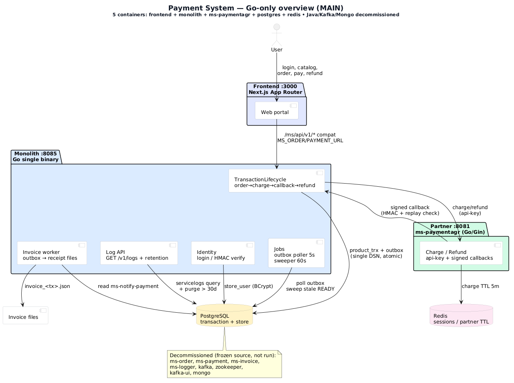
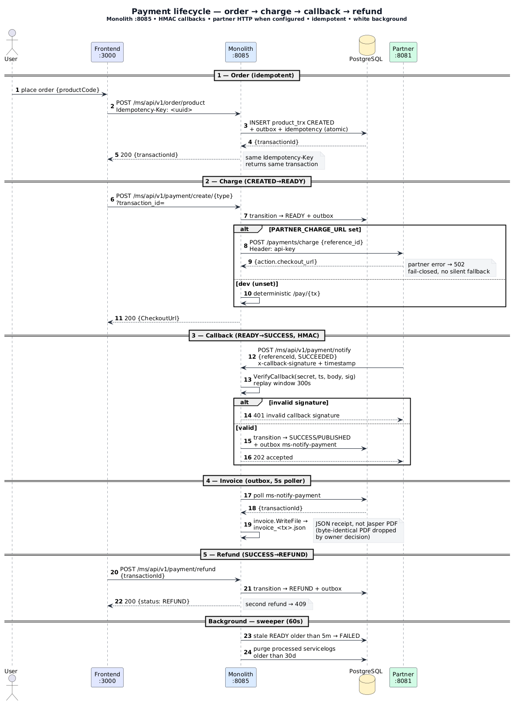
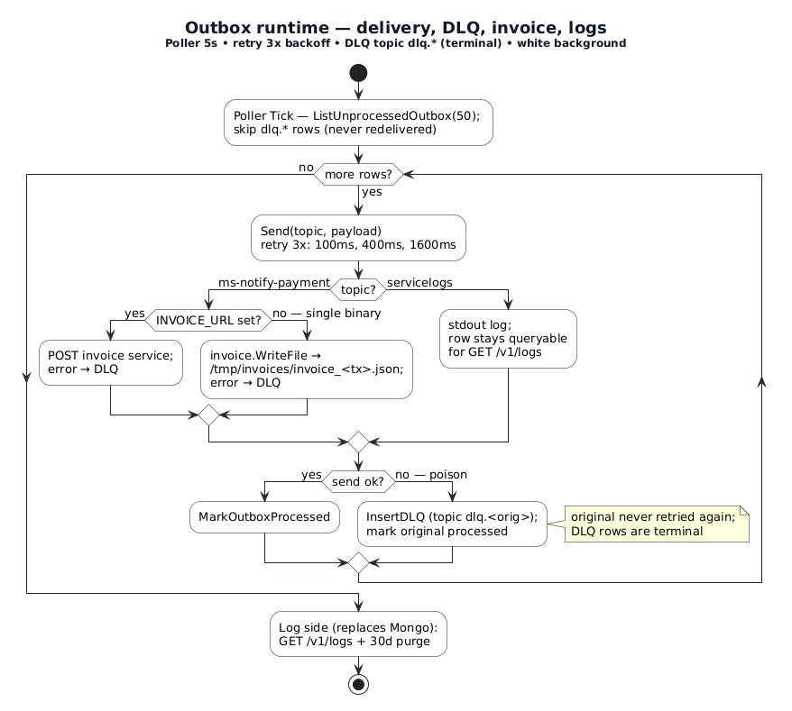

# payment-system

## Overview

Go payment system with a modern web frontend — the **Go monolith** (`monolith/`) deepens the payment lifecycle into a single `TransactionLifecycle` Module. Java services are decommissioned (frozen source, not run).

* **frontend** - Next.js (App Router) web portal: login, product catalog, order placement, payment checkout, status tracking and refunds
* **monolith** - **Go (primary)** — `TransactionLifecycle` deep Module: order → charge → callback → refund, idempotency, authz, pricing, HMAC-verified callbacks, partner charge via `api-key`, invoice worker (outbox → receipt files), log query API (`GET /v1/logs`) + retention, outbox poller with DLQ + sweeper. Single binary, PG `transaction` + `store` schemas, Redis
* **ms-paymentagr** - Go/Gin + Redis: dummy payment partner (charge, refund, redirect/checkout page, HMAC-signed callbacks)
* **ms-order / ms-payment / ms-invoice / ms-logger** - Java/Spring (decommissioned): frozen source kept for audit; replaced by monolith + PG outbox. Kafka/Mongo/ZK removed from compose

## Architecture Diagrams

> PlantUML sources with **white background** (`skinparam backgroundColor #FFFFFF`) for docs/printing. Render with `docker run --rm -v "$(pwd)/assets:/data" plantuml/plantuml /data/'*.puml' -tpng`.

**1 — System overview (MAIN)** — all 5 containers and how they connect (frontend → monolith → postgres/redis/partner; outbox → invoice files; logs query):



Source: [`assets/system-main.puml`](assets/system-main.puml)

**2 — Payment lifecycle sequence** — order → charge → HMAC callback → invoice → refund, plus sweeper/retention background work:



Source: [`assets/sequence-lifecycle.puml`](assets/sequence-lifecycle.puml)

**3 — Outbox runtime** — poller routing, 3x retry + DLQ, invoice files, log query + retention (the Kafka/Mongo replacement):



Source: [`assets/runtime-outbox.puml`](assets/runtime-outbox.puml)

Legacy references: `payment-system-diagram.jpg` (original Java microservices), `assets/sequence-monolith.puml/png` (earlier monolith draft), `assets/simple-order-ms.txt`.

## Tech Stack

* **Go monolith** - `TransactionLifecycle` deep Module: `net/http` stdlib, `pgx` + PG outbox/idempotency, HMAC callback verify, partner charge via `api-key`, invoice worker, log query + retention, poller with DLQ + sweeper, white-background PlantUML docs
* Go + Gin + Redis - ms-paymentagr (payment partner simulation)
* PostgreSQL - `transaction` + `store` schemas (monolith single-DSN) and `partner` DB
* Redis - sessions / partner TTL
* Next.js 16 + TypeScript + Tailwind CSS - web frontend (pointed at `monolith:8085`)
* Docker Compose - 5 containers (`postgres+redis+ms-paymentagr+monolith+frontend`)
* Java Spring Boot 17 - decommissioned (`ms-order`, `ms-payment`, `ms-logger`, `ms-invoice` frozen, not run); Kafka/Mongo/ZK removed

## Getting Started

### 1. Prerequisites

* Docker with Docker Compose v2
* Node.js 20+ and npm (only for frontend development outside Docker)

### 2. Configure environment

```bash
cd project
cp .env.example .env
# EDIT .env and change every secret before deploying
```

### 3. Build and start all services

```bash
# Go-only stack: postgres + redis + ms-paymentagr + monolith + frontend — 5 containers
# Seeds PostgreSQL (store + transaction schemas + outbox/idempotency + demo users/products) on first boot
cd project && docker compose up --build
```

This seeds PostgreSQL (schemas + demo users/products) on first boot, then starts all services. The new `22-monolith-outbox.sql` seeds `store.*` into the `transaction` DB so the monolith can serve `store` reads via a single `DATABASE_URL`.

### 4. Access the system

* **Web portal**: <http://localhost:3000> (via `monolith:8085` when `MS_ORDER_URL`/`MS_PAYMENT_URL=http://monolith:8085`)
* **monolith** (API, Go): <http://localhost:8085> — `GET /health`, `GET /v1/logs?limit=`, `GET /ms/api/v1/view/product`, `POST /ms/api/v1/auth/login`, `POST /ms/api/v1/order/product`, `POST /ms/api/v1/payment/create/{type}`, `POST /ms/api/v1/payment/refund`, `POST /ms/api/v1/payment/notify` — and new `POST /v1/order`, `POST /v1/payment/charge`, etc.
* **ms-paymentagr**: <http://localhost:8081> (`/health`)

### 5. Demo accounts

Seeded in PostgreSQL on first boot (see `project/pg-init-scripts/sql/20-store-schema.sql`):

| Username   | Password      | Access            |
|------------|---------------|-------------------|
| `klhomme0` | `user1Pass!`  | special products  |
| `ewhicher1`| `user2Pass!`  | standard products |
| `jdecreuze2`| `user3Pass!` | special products  |
| `admin1`   | `adminPass!`  | special products  |

### 6. End-to-end flow (via monolith when wired)

1. Sign in on the web portal (`POST /ms/api/v1/auth/login` → BCrypt verify, `store.store_user`)
2. Pick a product from the catalog (`GET /ms/api/v1/view/product?username=` → specialProduct filter)
3. Place order (`POST /ms/api/v1/order/product` with `Idempotency-Key` → `calcPriceCharge` inside `TransactionLifecycle`, `INSERT product_trx CREATED` + outbox + idempotency atomically)
4. Create payment (`POST /ms/api/v1/payment/create/SHOPEEPAY?transaction_id=` → `CREATED→READY`; calls `ms-paymentagr` with `api-key` when `PARTNER_CHARGE_URL` is set, fail-closed 502 on partner error; idempotent second call returns same `CheckoutUrl`)
5. Confirm (frontend polls `GET /ms/api/v1/order/{id}/check?username=` with authz `username→userId` check; partner `POST /ms/api/v1/payment/notify` with `SUCCEEDED` + `x-callback-signature`/`x-callback-timestamp` → HMAC + 300s replay verified → `READY→SUCCESS/PUBLISHED` + outbox `ms-notify-payment`; forged callbacks get 401)
6. Poller (5s) routes outbox: `ms-notify-payment` → invoice receipt file (`INVOICE_DIR/invoice_<tx>.json`), `servicelogs` stay queryable; poison rows get 3x backoff then terminal DLQ (`dlq.*`, never redelivered). Sweeper (60s) moves stale `READY→FAILED` after 5m and purges processed `servicelogs` older than `LOG_RETENTION_DAYS` (30)
7. Refund (`POST /ms/api/v1/payment/refund` → `SUCCESS→REFUND`, second refund 409); logs at `GET /v1/logs?limit=`

### 7. Stopping the services

```bash
docker compose down
```

## Security

* **Authenticated payment callbacks** - ms-paymentagr signs every callback with HMAC-SHA256 (`NOTIFY_SECRET` + timestamp); monolith verifies signature and 300s replay window before accepting (401 on forgery; open only when `NOTIFY_SECRET` is unset for local dev)
* **API key protection** - ms-paymentagr charge/refund endpoints require the `api-key` header (`PARTNER_API_KEY`); monolith sends it on partner charge calls
* **Session-based auth** - ms-order issues short-lived opaque session tokens (in-memory, TTL); order placement accepts `Authorization: Bearer` tokens
* **Password hashing** - BCrypt for new credentials, legacy HMAC verification kept for backward compatibility
* **Login rate limiting** - per user/IP attempts (10 / 15 minutes)
* **No credential leakage** - user detail responses never expose password hashes or stored tokens
* **Parameterized SQL** - all queries use prepared statements; the previous string-replace query pattern was removed
* **Secrets via environment** - no hardcoded credentials in source or compose; `.env` is gitignored, a `.env.example` template is provided
* **Path traversal protection** - invoice filenames sanitize the transaction id
* **Kafka reliability** - consumers acknowledge only after processing (no lost events)
* **Dependency updates** - gson 2.11, gin 1.10, go-redis 9.5, x/net 0.25, JasperReports 6.21.4, Next.js 16 (npm audit clean)
* **Container hardening** - all containers run as non-root users; infra ports bind to `127.0.0.1` only
* **Security headers** - CORS allowlist plus `X-Content-Type-Options`, `X-Frame-Options`, `CSP`, `Referrer-Policy`, `Cache-Control: no-store`
* **Removed attack surface** - unauthenticated log-publish endpoint removed, partner `/payments/test` endpoint removed
* **Live DB data no longer committed** - `project/db-data/` is removed from the repository

## Testing

```bash
# Go monolith — TransactionLifecycle deep Module (tests are the gate per phase)
cd monolith && go vet ./... && go test ./... -count=1
# live-binary e2e (MemoryStore dev mode): order → charge → forged-401 → signed-202 →
# check SUCCESS → poller invoice file → refund → refund-409 → GET /v1/logs

# Go partner
cd ms-paymentagr && go vet ./... && go build ./...

# Frontend
cd frontend && npm ci && npm run build

# PlantUML diagrams (white background) — all three; needs Docker
# (system-main = MAIN overview, sequence-lifecycle, runtime-outbox)
docker run --rm -v "$(pwd)/assets:/data" plantuml/plantuml /data/'*.puml' -tpng
```

CI (`.github/workflows/ci-cd-pipeline.yml`) runs all of the above plus full-stack compose health checks on every push to `master`. The monolith image also builds and vets in CI (`plantuml` render is optional).
